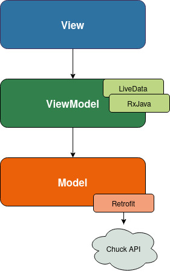

# Chuck Norris joke app

>For this session I wrote an application displaying data from this **[public web API](https://api.chucknorris.io/)**.

The development of this application was done in two parts as following
## Part 1: Retrieve and display data

 - Dynamic list with RecyclerView
 - Web API call and JSon data struct with **Retrofit**
 - Asynchronous code with **RxJava**
 - Activity lifecycle for **Shared Preference**  and **Rotation Management**
 - Data Share with other applications to send hilarious jokes to your friend !

## Part 2: MVVM
In the first part I didn't respect a particular architecture which caused problems with each addition of functionality. In order to better partition the roles of each class the application now respects the architecture recommended by Android: **MVVM**

You can find the application before theses changes [here](https://github.com/lefevrej/OUAP_4316/tree/9fd9be1707aece4003ec70e6250573cbb103a52c) !

## Demo

